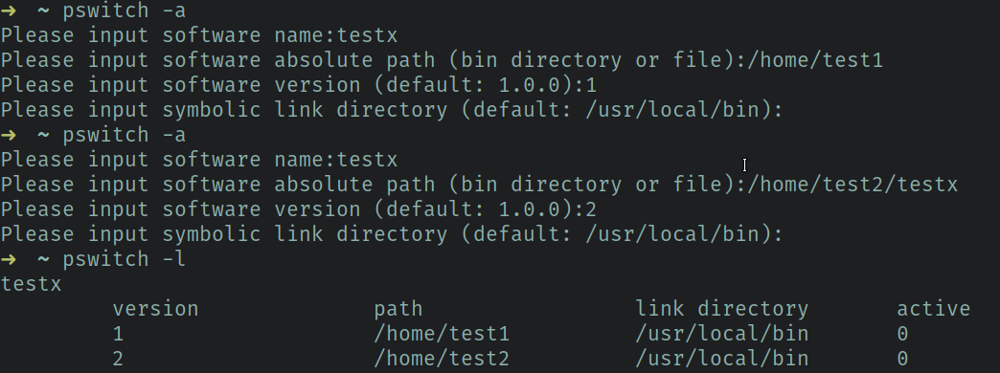
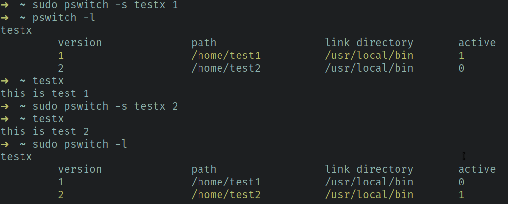

# Description

Pswitch is a tool for switching software versions.

Replace update-alternatives in non-debian distro.

## Requirement

    php5.6+

## Install
    
    sudo mv pswitch.php /usr/local/bin
    
## Help

    PSWITCH Help
    ------------------
    Options
    --help           this help
    -a               add software version
    -s               switch software version. 
                     e.g: pswitch -s [software name] [software version]
    -l               show the software list
                     e.g: pswitch -l / pswitch -l [software name]
    -d               delete software version
                     e.g: pswitch -d [software name] [software version]
    -v               show PSWITCH version

## Example

